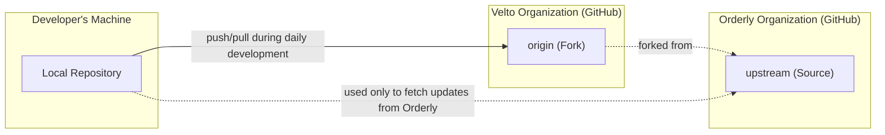

# Velto and Orderly Merge

The instructions below will guide you through setting up multiple remote repos (`origin` and `upstream`, these names are convention) and interacting with them. This is necessary to facilitate the merge process across two different GitHub organizations. See the diagram below.



```bash
# Clone this repo
# This automatically creates your primary remote repo, "origin"
git clone git@github.com:veltodefi/orderly-js-sdk.git

# Switch to Velto's default branch
git checkout velto-main

# Create a sync branch with the correct version number
git checkout -b sync-with-orderly/0.0.0

# Add the Orderly repo as a secondary remote repo, "upstream"
git remote add upstream https://github.com/OrderlyNetwork/orderly-js-sdk.git

# ⚠️ Now your local repo will be linked to two remote repos: origin (the Velto GitHub repo) and upstream (the Orderly GitHub repo)

# Fetch tags from Orderly
git fetch upstream --tags

# Merge latest tag to velto-main
# You can find the latest tag here: https://github.com/OrderlyNetwork/js-sdk/tags
git merge v0.0.0

# ⚠️ This merge generally results in a headache-inducing number of conflicts, though most of them are easily solved. Run the conflict auto-resolution script to handle most of them.
node scripts/resolve-conflicts.js

# ⚠️ Handle the rest of the conflicts manually!

# Make sure these commands execute without issue
pnpm install
pnpm build

# ⚠️ IMPORTANT: Generate a classic GitHub Personal Access Token with repo, write:packages and read:packages permissions. See doc:
# https://docs.github.com/en/authentication/keeping-your-account-and-data-secure/managing-your-personal-access-tokens

# Set environment variables in your current terminal session
export GIT_USERNAME="git-username"
export GIT_NAME="Your Name"
export GIT_EMAIL="your@email.com"
export GIT_TOKEN="your_github_pat" # SAME VALUE
export NPM_TOKEN="your_github_pat" # SAME VALUE
export NPM_REGISTRY="https://npm.pkg.github.com"  # GitHub Packages

# Run release:velto command (handles versioning, building, and publishing)
pnpm release:velto

# Commit version-bump changes
git add .
git commit -m "chore: bump version to v0.0.0-velto-main.0"

# Push to origin
git push

# Now go through the process of opening PRs in the webapp and SDK repos.
```

# Orderly SDKs

[](https://deepwiki.com/OrderlyNetwork/js-sdk)
[](https://www.npmjs.com/package/@veltodefi/hooks)
[](https://www.npmjs.com/package/@veltodefi/core)
[](https://www.npmjs.com/package/@veltodefi/perp)
[](https://www.npmjs.com/package/@veltodefi/wallet-connector-privy)
[](https://www.npmjs.com/package/@veltodefi/wallet-connector)
[](https://www.npmjs.com/package/@veltodefi/types)
[](https://www.npmjs.com/package/@veltodefi/ui)
[](https://www.npmjs.com/package/@veltodefi/trading)
[](https://www.npmjs.com/package/@veltodefi/i18n)

Monorepo for all Orderly SDKs. Please check out our [documentation](https://orderly.network/docs/sdks).

If you have any questions about the code in this repository, you can also ask [deepwiki](https://deepwiki.com/OrderlyNetwork/js-sdk).

## Getting Started

1. Install dependencies:

```bash
pnpm install
```

2. Start the development server:

```bash
pnpm dev
```

3. Start the Storybook development server:

```bash
pnpm storybook
```

## Integration Templates:

Start building with Orderly SDKs using these ready-to-use templates:

- [Vite Template](https://github.com/OrderlyNetwork/orderly-js-sdk-vite-template)

- [Next.js Template](https://github.com/OrderlyNetwork/orderly-js-sdk-nextjs-template)

- [Remix Template](https://github.com/OrderlyNetwork/orderly-js-sdk-remix-template)

- [Create React App Template](https://github.com/OrderlyNetwork/orderly-js-sdk-cra-template)

## Env config

- env

  config env: dev, qa, staging, prod

- networkId

  mainnet/testnet

- brokerId

  set your broker id

- brokerName

  set broker name

- theme

  orderly/custom

- usePrivy

  true/false

```
http://localhost:5173/en/perp/PERP_ETH_USDC?env=prod&networkId=mainnet&brokerId=demo&broderName=Orderly&theme=orderly&usePrivy=false
```
